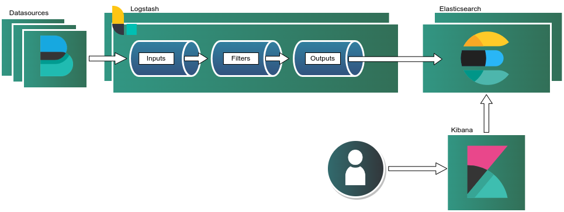

# Akamai Cloud ELK One-Click Cluster



Deploy a fully configured, multi-node ELK (Elasticsearch, Logstash, Kibana) cluster on the Akamai Cloud using our One-Click deployement. Our ELK stack leverages mTLS certificates to secure communication between nodes, ensuring data integrity and privacy across the cluster.

This solution delivers powerful log management, search, and visualization capabilities helping you centralize logs, monitor applications, and gain real-time insights into system performance. Our One-Click Elk deployement removes the complexity of manual setup so you can focus on analyzing data instead of configuring infrastructure.

## Software Included

The ELK cluster is configured on the `elastic-9.x` package.

| Software      | Version   | Description |
| :---          | :----     | :---        |
| Kibana | 9.1.3 | A visualization and dashboard tool that lets you explore, analyze, and present data stored in Elasticsearch. |
| Elasticsearch | 9.1.3 | A distributed search and analytics engine that stores, indexes, and queries data at scale in real time. |
| Logstash | 9.1.3 | A data processing pipeline that ingests, transforms, and ships logs or event data from multiple sources. |
| Nginx | 1.24.0 | Web server reverse proxy. Used for Elastic web IU in Kibana. |

**Supported Distribution:**

- Ubuntu 24.04 LTS

## Post Deployment

### Credentials

Once your ELK deployment is complete, you can find all of the credentials created on the *provisioner* node in the cluster. This is typically found in the sudo home directory. Assuming that the sudo user is `admin`:

- `/home/admin/.credentials`

In this file you will find the following credentials:

| Name | Description |
| :---          | :----  |
| sudo username | The privileged sudo username created.  |
| sudo password | The password to the sudo user you created. |
| Elastic password | Elasticsearch was secured during the configuration. This is the password you use to log into the Elastic web interface. |
| Kibana system password | This password allows Kibana to connect to Elasticsearch. |
| Logstash ingest password | Logstash connects to Elasticsearch on a via an ingest user that was created. |
| Logstash ingest user | This user is what Logstash uses in the `/etc/logstash/conf.d/example-pipeline.conf`. It's a limited user that has access to an indeces, and a Index Lifecyle Policy. |

[!WARNING]

Ideally want to remove the `/home/admin/.credentials` file once you copy the credentials down to your password manager.

### SSL Certificates

All nodes in your ELK cluster communicates securetly which means that traffic flowing between each instance is encrypted via mTLS. Every component in your stack has SSL certifcates and follow the same convention and semantics. For example:

- Kibana (provisioner node):
    - `/etc/kibana/certs/`
        - | Name | Description |
          |:---  | :---        |
          | ca.crt | Certificate Authority |
          | kibana.local.crt | Kibana SSL certificate | 
          | kibana.local.key | Kibana private key cert |
          | kibana.local.csr | Kibana Cert Signing Request |

Certificate name are created according to the instance's hostname. 

The provisioner node also contains all certificates in the cluster because it's used a Certificate Authority to generate, sign and distribute the certificates to the cluster. You can find all of the certicates including the CA private key below:

- `/root/cluster-certificates`

```
├── ca
│   ├── ca.crt
│   ├── ca.csr
│   └── ca.key
├── elasticsearch-1.local
│   ├── elasticsearch-1.local.crt
│   ├── elasticsearch-1.local.csr
│   └── elasticsearch-1.local.key
├── elasticsearch-2.local
│   ├── elasticsearch-2.local.crt
│   ├── elasticsearch-2.local.csr
│   └── elasticsearch-2.local.key
├── kibana.local
│   ├── kibana.local.crt
│   ├── kibana.local.csr
│   └── kibana.local.key
├── logstash-1.local
│   ├── logstash-1.local.crt
│   ├── logstash-1.local.csr
│   └── logstash-1.local.key
└── logstash-2.local
    ├── logstash-2.local.crt
    ├── logstash-2.local.csr
    └── logstash-2.local.key
```

### Logstash Pipeline

Our ELK cluster comes with an example pipeline that will allow your Filebeat agent to send data to. The configuration can be found on *each* Logstash instance below:

- `/etc/logstash/conf.d/example-pipeline.conf`

This is relevant to know because you will need to reference the same input port in your Filebeat configuration.

### Configuring Filebeat

To sent data to your ELK stack you will need to configure your Filebeat agent accordingly. Unlike the members in your ELK stack with mTLS, the Filebeat agent only needs to present a valid CA cert. This will ensure authentication without credentials and allow encryption between your agent and Logstash.

#### Installation
The first thing you will need to do is install Filebeat. Please follow the correct installation instruction for your distribution. Below you can find the installation for Ubuntu 24.04 LTS.

- Add repository and key:

```bash
echo "deb [signed-by=/usr/share/keyrings/elasticsearch-keyring.gpg] https://artifacts.elastic.co/packages/9.x/apt stable main" | sudo tee /etc/apt/sources.list.d/elastic-9.x.list

wget -qO - https://artifacts.elastic.co/GPG-KEY-elasticsearch | sudo gpg --dearmor -o /usr/share/keyrings/elasticsearch-keyring.gpg
```

- Update packages and install Filebeat:

```bash
apt update -y
apt install filebeat -y
```

#### Configure Filebeat

- Create a backup of your `/etc/filebeat/filebeat.yml` configuration:

```bash
cp /etc/filebeat/filebeat.yml{,.bak}
```

- Update your filebeat inputs:


`/etc/filebeat/filebeat.yml`:
```yaml
filebeat.inputs:

# Each - is an input. Most options can be set at the input level, so
# you can use different inputs for various configurations.
# Below are the input-specific configurations.

# filestream is an input for collecting log messages from files.
- type: filestream
 
  # Unique ID among all inputs, an ID is required.
  id: web-01 
 
  # Change to true to enable this input configuration.
  #enabled: false
  enabled: true
 
  # Paths that should be crawled and fetched. Glob based paths.
  paths:
    - /var/log/apache2/access.log
```

In this example, the `id` must be unique to the instance that way you know the source of the log. Ideally this should be the hostname of the instnace. Update `paths` to the log that you want to send to Logstash.

Next, while in the `/etc/filebeat/filebeat.yml`, update the filbeat output:

```yaml
output.logstash:
  # The Logstash hosts
  hosts: ["logstash-1.local:5044", "logstash-2.local:5044"]
  loadbalance: true

  # Optional SSL. By default is off.
  # List of root certificates for HTTPS server verifications
  ssl.certificate_authorities: ["/etc/filebeat/certs/ca.pem"]
```

- Add CA certificate. 

The last thing that you want to do is add the `ca.crt` to `/etc/filebeat/certs/ca.pem`. You can grab the `ca.crt` from any node in the cluster. Once that's in place, just restart the filebeat service:

```bash 
systemctl start filebeat
systemctl enable filebeat
```